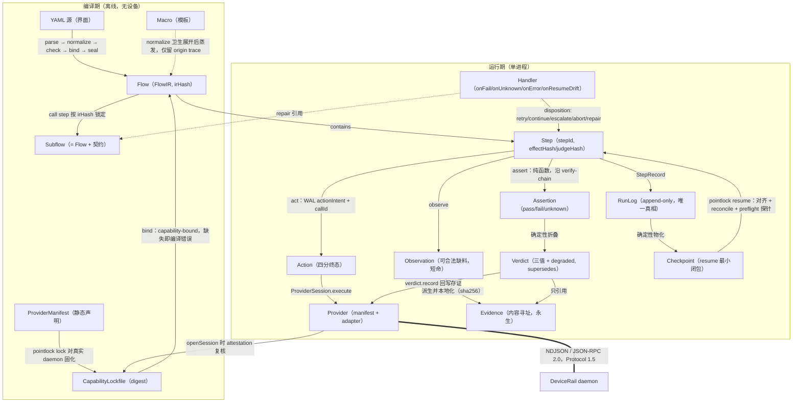

# Pointlock 定位与核心概念

> 本文是 Pointlock 设计文档系列第 1 篇，骨架见 [00-architecture-spine.md](./00-architecture-spine.md)。骨架是唯一上位依据；本文与骨架冲突时以骨架为准。
>
> 覆盖需求产出 1（项目定位与命名）与产出 2（核心概念权威定义）。全部 DeviceRail wire 层名称与骨架附录 A.8 的已核实清单逐字一致。

---

## 1. 项目定位

### 1.1 一句话陈述

**Pointlock 是运行在 DeviceRail 之上的声明式设备流程编排与验证系统：把 YAML 流程编译为 capability-bound 的 Typed IR，在真实设备上留痕执行，对每一步产出以证据（Evidence）支撑的三值判定（`pass | fail | unknown`），并支持崩溃后精确续跑与局部修复后不重跑设备的离线重判。**

拆成三个承诺，这就是 Pointlock 相对于「脚本 + 设备驱动」的全部增量：

1. **编译期承诺**：流程在没有设备在线的情况下就能被证明「可执行」——每个动作、每条断言所需的能力都对着 `CapabilityLockfile` 逐项核验，能力缺失是编译错误，不是运行期惊喜（原则 5）。
2. **运行期承诺**：每个 mutating 动作发出前先写 WAL 意图（`actionIntent` + `callId`），进程在任何一点崩溃，都能凭 `callId` 向 DeviceRail 事件日志核对（`reconcile`）动作的真实下落，绝不盲目重放、也绝不假装没发生。
3. **判定承诺**：动作成功 ≠ 语义通过（原则 3）。每一步的结论由断言对观测的纯函数求值折叠产生；证据不足时输出 `unknown` 而非猜测（原则 4）；结论引用内容寻址的 Evidence，事后可审计、可离线重判。

### 1.2 Pointlock 不是什么

- **不是 DeviceRail 的替代或封装壳**。DeviceRail 管「一次动作在一台设备上的可靠执行与留证」；Pointlock 管「一串动作作为一个流程的编排、判定与续跑」。判定权在 Pointlock：`verdict.record` 回写时 daemon 只校验持久化，不运行断言。
- **不是 agent 框架**。Pointlock 的控制流在编译期封闭（7 种 step kind、非图灵完备表达式），没有模型即兴决策。视觉能力（`pointlock-vision`）只能出现在 verify-chain 链尾做降级验证，永远不做定位或主验证（原则 7）。
- **不是通用 workflow 平台**。不做分布式调度、不做队列、不上 Temporal（原则 10）；v0.1 单进程 + SQLite 本地存储。
- **不是 RPA 录制器**。流程是手写并接受评审的 YAML 源码，经五阶段编译成 IR；YAML 是界面，不是执行协议（原则 1），runner 只接受 `FlowIR`（原则 2）。
- **不是 CI 系统**。Pointlock 产出可判定、可归档的运行报告与判例卷宗（`pointlock report` / `pointlock locate`），如何触发与门禁是上层 CI 的事。

### 1.3 与参考系统的边界对照

| 项目 | 它是什么 | 抽象单位 | 状态与持久化 | 「成功」的含义 | Pointlock 与它的关系 / 关键差异 |
|---|---|---|---|---|---|
| **DeviceRail** | 设备自动化 daemon（JSON-RPC 2.0 over NDJSON，Protocol 1.5）：设备路由、单动作执行、观测、证据、会话事件日志 | 一次 `device.execute` / `device.observe` | Session 级 append-only 事件日志，终态落盘有 shield；session 删除是整段式 | action 终态 `succeeded`（不含语义判断） | **执行基座，v0.1 唯一 Provider。** 分工线：单动作的 effectively-once、终态持久化、证据采集归 daemon；跨动作的编排、断言、verdict 折叠、checkpoint/resume、修复对齐归 Pointlock。Pointlock 绝不绕过 daemon 碰驱动。工程上亦同构（骨架 R12）：实现语言（Rust 核心 + TS 外围的混合 monorepo，`crates/` + `packages/` + `schema/` 三分布局）与「Rust DTO 真相源 → JSON Schema / 类型包 / golden fixtures」代码生成管线均镜像 DeviceRail |
| **LangGraph** | LLM agent 状态图运行时（节点 = 含模型调用的函数，边可由模型输出决定） | Node / StateGraph | Checkpointer（可插拔），面向对话/推理状态回放 | 图跑到 END（无语义判定层） | 表面相似点是「图 + checkpoint + human-in-the-loop」。本质差异：LangGraph 的节点是任意代码、控制流可被模型即兴改写；Pointlock 的 IR 在编译期封闭、runner 零即兴（原则 6）、无 LLM 参与控制流。LangGraph 没有 action/assertion/verdict 三分，也没有能力绑定编译 |
| **Prefect** | Python 数据工程编排（flow/task 装饰器、状态机、重试、可观察性） | Task run | 结果持久化 + 状态数据库，面向重跑而非精确续点 | task 进入 Completed 状态（执行状态 ≠ 语义验证） | 借鉴其 flow/task 可观察性心智。差异：Prefect 的失败重跑以 task 幂等为前提假设，无 WAL 意图、无副作用核对；无 capability 概念（import 到什么就能跑什么）；「Completed」是执行状态，Pointlock 把执行状态与语义 verdict 硬性分离（骨架 R4：无断言的 mutating step 只有执行状态注记 `unverified`，没有 verdict） |
| **n8n** | 低代码 SaaS 集成自动化（可视化编辑器 + 运行时解释执行） | Node execution | 每次 execution 的数据快照 | 节点无异常跑完 | 反面参照：n8n 的画布 JSON 既是界面又是执行协议，编辑器语义即运行时语义。Pointlock 刻意切断这条路（原则 1/2）：YAML 经 `parse → normalize → check → bind → seal` 后不复存在，运行的是内容寻址的 `FlowIR` |
| **Temporal** | durable execution 平台（事件溯源 + 确定性 replay，分布式队列与 worker） | Workflow / Activity | Server 端 event history，workflow 代码必须确定性可重放 | Activity 完成（语义判定自理） | 架构精神最接近（RunLog 事件溯源、WAL、effectively-once 都是 Temporal 心智的单机化）。刻意不采用（原则 10）：Temporal 要求代码级确定性 replay 与常驻集群，运维成本与 v0.1 体量不匹配。Pointlock 用「SQLite WAL RunLog + `callId` reconcile + 断言纯函数」在单进程内达成同等正确性承诺；若未来上量，runner 状态机语义可平移，但那是 v1 之后的事 |

一句话总结边界：**LangGraph 编排推理，Prefect 编排数据，n8n 编排 SaaS，Temporal 提供 durable 执行底座；Pointlock 编排并「审判」真实设备上的副作用——审判（verdict + evidence + unknown 三值）是它们全都没有、而 Pointlock 视为立身之本的东西。**

### 1.4 与 DeviceRail 的分工线（细则）

| 职责 | 归属 | 依据 |
|---|---|---|
| 设备发现、选择、连接 | DeviceRail（`devices.list` `device.select` `device.connect`；connection-local，一个 `ProviderSession` 独占一个 client） | 骨架 §4.2 |
| 单动作执行与四分终态（`succeeded/failed/cancelled/timedOut`） | DeviceRail（`device.execute`，终态落盘有 shield） | 骨架 §6.2 |
| 动作身份与 effectively-once | 共担：`callId` 由 runner 生成并先写 WAL；daemon 以 `device.execute` 的 `params.id` 落账，崩溃后 runner 经 `events.list` 匹配 `actionStarted/actionCompleted` 的 `call.id` 核对 | 骨架 R2 |
| 观测与证据采集（screenshot / uiSnapshot / AssetRef） | DeviceRail 产生；Pointlock 立即本地化（`ui.snapshot.get` 仅本 Session 活跃期可读） | 骨架 §6.6 |
| 断言求值、verdict 折叠、降级授权 | Pointlock 独占（daemon 内部 `coordinateFallback` 降级须过 `acceptExecutionModes` 白名单审查） | 骨架 §6.3/§6.4 |
| verdict 持久化回写 | DeviceRail 存证（`verdict.record`，feature `verdict.record.v1`，只校验持久化） | 骨架 §4.2 |
| 流程级 checkpoint、resume、修复对齐、人机节点 | Pointlock 独占 | 骨架 §6.5–6.8 |

---

## 2. 命名评估

### 2.1 候选与事实

四个候选：**Pointlock**（现名，骨架已锁定 `pointlock-*` 十个 crate 名、`@pointlock/*` 四个 TS 包名（R14 补 `@pointlock/projection-types`）与 `pointlock` CLI）、**TaskRail**（既有备选）、**FlowRail** 与 **Railbook**（新候选）。

评估前先钉两个**已实测**的 npm 事实（2026-07-16 查询 registry.npmjs.org）：

- 非 scoped 包名 `pointlock` **已被占用**（v2.1.26），且占用者是 **pointlock.io——一个商业测试工具产品**（TestRail 的 CLI/CI 集成器，支持 JUnit/Pytest/Cucumber 等报告上传）。维护者 npm 用户名即 `pointlock`，意味着 **npm scope `@pointlock` 应视为被该用户锁定，我们无法在公共 registry 发布 `@pointlock/*`**。
- `taskrail`、`flowrail`、`railbook` 三个非 scoped 名在 npm 均为 404（未被占用）。

pointlock.io 的冲突不只是撞名：它与本项目同处**测试/自动化工具**域，搜索引擎、npm 搜索、招聘语境下都会直接混淆，且对方是持有 pointlock.io 域名的在营商业实体，商标风险非零。

### 2.2 评估矩阵

| 维度 | Pointlock | TaskRail | FlowRail | Railbook |
|---|---|---|---|---|
| **语义贴合**（编排流程 + 在轨约束 + 验证） | ★★★ 「flow 上了 rail」——rail 隐喻恰好承载 capability-bound、fail-closed、绝不即兴的产品性格 | ★☆☆ 「task」把颗粒度说小了（我们的单元是 flow/step，不是孤立 task），且暗示任务管理工具 | ★★★ 与 Pointlock 同素反序，语义等价 | ★★☆ 「可执行的 runbook」意象好，但丢了 flow/验证语义，易被当成文档工具 |
| **DeviceRail 品牌连续性** | ★★☆ 共享 Rail 语素，但构词模式相反（DeviceRail 是 `<名词>Rail`） | ★★★ 严格复刻 `<名词>Rail` 模式 | ★★★ 严格复刻 `<名词>Rail` 模式，且保住 flow 语素——连续性最优解 | ★☆☆ `Rail<名词>` 逆序，成系列感弱 |
| **npm 可用性（实测）** | ✗ 非 scoped 被占；`@pointlock` scope 视为被锁 | ✓ 未占用 | ✓ 未占用 | ✓ 未占用 |
| **域名直觉** | ✗ pointlock.io 在营；.com 大概率不可得 | 中性，taskrail.dev 直觉可得 | 中性，flowrail.dev 直觉可得；与 pointlock.io 仍有一定视觉相似（残余混淆风险） | 直觉可得 |
| **缩写/撞名冲突** | RF（无线电频率，弱冲突）；**与 pointlock.io 强冲突（同域商业产品）** | TR 与 TestRail 口头缩写撞车（对方正是测试域巨头，讽刺的是 pointlock.io 就是它的集成器） | FR（法国国家代码级弱冲突，可忽略） | 无显著冲突 |

> **crates.io 可用性脚注（R12 后补充）**：R12 后主要交付物是 Rust crate 与单一静态二进制，但 v0.x 不向 crates.io 发布（私有 Cargo workspace，publish 侧未定），crate 名冲突在私有 workspace 内不存在，故 crates.io 可用性**不构成本轮命名决策维度**，矩阵不为其增列（未实测）。§2.3 的更名触发条件命中（首次向任何公共 registry 发布）时，须一并实测 `flowrail-*` 系 crate 名在 crates.io 的可用性。

### 2.3 明确推荐

**推荐：v0.x 全程维持 Pointlock 为工作名与文档名；同时现在就把 FlowRail 钉死为公开发布名的第一顺位，触发条件写死，不留到发布前夕再吵。**

理由与决策结构：

1. **骨架已锁定**。`pointlock-*` 十个 crate 名、`@pointlock/*` 四个包名（R14 补 `@pointlock/projection-types`）、`pointlock` 七个 CLI 命令已进入 Canonical Vocabulary（骨架 A.1/A.2，R12/R14），是全部 8 份下游文档的强制词汇。此刻改名的代价是全系列文档 + monorepo 命名重置，而 v0.1 是**私有混合 monorepo（Cargo workspace，publish 侧未定 + 私有 pnpm workspace），不发公共 npm 包 / crate**——pointlock.io 的占用在 v0.x 阶段构成零实际阻塞。
2. **冲突是发布期问题，且已有确定解**。FlowRail 在四个维度上是唯一「语义无损 + 品牌连续性反而更好（对齐 `<名词>Rail` 模式）+ npm 实测可用」的候选。TaskRail 输在语义（颗粒度错位）与 TR 缩写；Railbook 输在语义漂移与系列感。
3. **触发条件（写死）**：首次向公共 registry 发布任何包、或注册对外域名/商标之前，若 `@pointlock` scope 仍不可得（几乎必然）或法务判定与 pointlock.io 存在混淆风险（大概率），则执行 Pointlock → FlowRail 更名，crate 名 `flowrail-*`、包名 `@flowrail/*`、CLI `flowrail`。届时为一次机械的全局替换——正因为本系列所有文档都严格使用 Canonical Vocabulary，改名成本是 `sed` 级而非考古级。
4. 更名属于骨架修订，须走架构评审（骨架文档地位条款）；本文将其列入 openQuestions 上报。

---

## 3. 十三个核心概念

本节对骨架 §2 的十三个概念逐一给出：**权威定义**（与骨架逐字对齐的压缩表述）、**生命周期**、**持有者**（类型定义在哪个 crate / 包、谁产生、谁消费、落在哪）、**判别标准**（与相邻概念的边界测试）。

先给一个贯穿本节的示例流程（示意；YAML 完整语法契约见系列第 2 篇，此处仅使用骨架 A.7 封闭关键字清单）：

```yaml
flow: submit_expense
provider: devicerail
verdict_policy: strict

params:
  amount: { type: string, required: true }

outputs:
  receipt_id: ${{ steps.read_receipt.output.receipt_id }}

handlers:
  - on_resume_drift:
      repair: ensure_logged_in      # 修复 subflow，编译期按 irHash 锁定

steps:
  - id: open_form
    tap:
      element: { role: button, name: "New Expense" }
    effect: mutating
    locate_via: [dom, uiTree]       # act-chain：显式声明，永远不含 vision
    expect:
      - element: { role: heading, name: "Expense Details" }
        state: visible
        verify_via: [uiTree, vision]  # verify-chain：vision 只准在链尾

  - id: fill_amount
    set_value:
      element: { identifier: "amount-input" }
      value: ${{ params.amount }}
    effect: mutating
    retry: { max_attempts: 3, backoff_ms: 500, retry_on: [action_failed_retryable, target_stale] }
    expect:
      - element: { identifier: "amount-input" }
        value: ${{ params.amount }}

  - id: confirm_submit
    human:
      mode: confirm
      prompt: "即将提交金额 ${{ params.amount }}，确认？"
      presents: ["${{ steps.fill_amount.verdict }}"]
      on_timeout: unknown
    timeout_ms: 600000

  - id: submit
    tap:
      element: { role: button, name: "Submit" }
    effect: mutating
    preflight:
      - element: { role: button, name: "Submit" }
        state: enabled              # 前置探针，兼作 resume 漂移检测
    expect:
      - element: { text: { value: "Submitted", mode: contains } }
        state: visible

  - id: read_receipt
    call: read_receipt_flow
    inputs: { }
```

### 3.1 Flow

**权威定义**：编译产物中的可执行单元：带 params/outputs 契约的 Step 有序结构（v1 为顺序 + 有限控制结构），有内容哈希 `irHash`。一次执行（Run）= 对一份 `FlowIR` 的一次留痕遍历，绑定恰好一台设备、一条活跃 DeviceRail Session（断代重开时形成 `sessionLineage`）。

**生命周期**：YAML 源 → `pointlock compile`（五阶段，YAML 在 `parse` 后不复存在）→ `seal` 产出 `FlowIR` 并计算 `irHash` → 归档。此后**不可变**：修改源码 = 新 `irHash` = 新的 Flow 版本；旧版本不删除，因为其他 flow 可能以 `flowRef: { flowId, irHash }` 锁定引用它，历史 Run 也以 `irHash` 锚定。Flow 没有运行期可变状态——运行期状态全部属于 Run。

**持有者**：类型 `FlowIR` 定义于 `pointlock-ir`；`pointlock-compiler` 独家产生；`pointlock-runner` 只读消费（入口签名只接受 `FlowIR`，不接受字符串——原则 1/2 的结构性保证）；`pointlock-store` 持久化。

**判别**：
- *Flow vs Run*：Flow 是不可变程序，Run 是「(`irHash`, `paramsSnapshot`, `bindingSpec`, `runId`) 四元组 + 一条 append-only RunLog」。问「它有没有 verdict？」——Flow 没有，Run 的每次遍历产生 verdict。
- *Flow vs Subflow*：Subflow 不是另一种类型，而是 Flow 在被 `call` step 引用时扮演的**角色**（见 3.3）。

### 3.2 Step

**权威定义**：最小可调度、可 checkpoint 的执行单元，有唯一 `stepId`、生命周期状态机、至多一个 Verdict。kind 封闭七种：`action | assert | call | human | if | foreach | let`。action step 内部是固定流水线 `preflight? → act → observe → assert`。

**生命周期**：编译期以 `StepIR` 存在（携带 `effectHash` / `judgeHash` 双哈希——分别回答「这一步对世界做什么」和「这一步如何被判定」）；运行期走封闭状态机 `pending → ready → probing → acting → settling → observing → asserting → judged{pass|fail|unknown}`，旁路出口 `skipped / blocked / drifted / awaitingHuman / suspended / aborted`；终结时物化为 `StepRecord`（含 `resolvedInputs` 快照、attempts、observations、evidence、assertionOutcomes、verdict）进 RunLog，`stepId` 稳定跨修复存活（修复时不改 id 即保身份，是 §6.7 对齐的锚点）。

**持有者**：`StepIR`/`StepBase` 定义于 `pointlock-ir`；状态机由 `pointlock-runner` 驱动；`StepRecord` 落 `pointlock-store`。

**判别**：
- *Step vs Action*：Step 是调度与判定单元（四阶段流水线 + 至多一个 verdict）；Action 只是 act 阶段的一次设备调用。一个 step 经 retry 与 attempt 链可产生**多个** Action（各有独立 `callId`），但永远只有至多一个 verdict。
- *Step vs Flow*：能否被 `call`？Flow 能，step 不能；step 没有 params/outputs 契约，只有表达式作用域内的 `outputs` 抽取。

### 3.3 Subflow

**权威定义**：被当作一个 step 调用的 Flow，一等公民（原则 9）：显式 input/output 契约（call-by-value）、独立编译与版本化（按 `irHash` 锁定）、运行期有调用帧（call frame）、可独立测试、作用域封闭（callee 只见显式 inputs）。

**生命周期**：独立编译产出自己的 `FlowIR`；caller 编译的 `normalize` 阶段按 `irHash` 锁定引用（`CallStepIR.flowRef`，引用不内联，`subflows` 表登记）；运行期 `call` step 进入时写 `callFramePushed`、退出写 `callFramePopped`，`RunPath` 中留 `{ kind: "call", stepId, calleeFlowId, calleeIrHash }` 帧；callee 的 flow verdict 上浮为 call step 的 verdict。

**持有者**：`CallStepIR` 定义于 `pointlock-ir`；链接由 `pointlock-compiler` 完成；`CallFrame` 由 `pointlock-runner` 维护并进 `CheckpointView.frames`。

**判别**：见 3.5 的三问表。补一条硬边界：Subflow 是**数据流的墙**——callee 看不见 caller 的 `steps.*` / `vars.*`，caller 只见 callee 声明的 `outputs`。Macro 展开体则完全活在宿主作用域里。

### 3.4 Macro

**权威定义**：编译期模板：参数化 step 序列，`normalize` 阶段卫生展开（hygiene 重命名）后彻底消失——无运行期身份、无独立 verdict、无独立 checkpoint；只留 origin trace（展开链）供 `sourceMap` 把 IR 路径映射回 YAML 源。禁递归。

**生命周期**：只存在于 YAML 源（`macros` 顶层键）与编译器 `normalize` 阶段之间。展开后蒸发：`RunPath` 里永远不出现宏帧（骨架 §9 硬规则 2），报告要回溯宏调用链时走 `sourceMap` 的 origin trace。展开体内 step 的 `checkpoint` 默认 `false`（骨架 §3 `StepBase`）。

**持有者**：`pointlock-compiler` 独占；IR 与 runner 对 Macro 一无所知。

**判别**：问「运行崩溃时能停在它中间吗？」——Macro 不能（它已不存在，停下的是展开出的某个 step）；Subflow 能（有 call frame 与 checkpoint 边界）。

### 3.5 Handler

**权威定义**：挂在明确钩子（`onFail | onUnknown | onError | onResumeDrift`）上的显式策略，由 runner 状态机在特定转移上触发，不出现在正常控制流。产物是处置决定（Disposition：`retry | continue | escalate | abort | repair`），**没有可被数据流引用的输出**；执行留 StepRecord 审计痕（RunPath 带 `hook` 帧）。`maxTriggers` 防循环。

**生命周期**：IR 声明（`HandlerBinding`，flow 级或 step 级，step 级覆盖 flow 级）→ 运行期状态转移命中钩子（如 `judged{fail}` 触发 `onFail`、resume 探针失败进入 `drifted` 触发 `onResumeDrift`）→ 写 `handlerTriggered` 事件 → 执行 `HandlerAction` → 产出 disposition 改写宿主 step 的走向。触发计数跨整个 Run 累积，超 `maxTriggers` 停手（`onResumeDrift` 超限 → `awaitingHuman`）。

**持有者**：`HandlerBinding`/`HandlerAction` 定义于 `pointlock-ir`；handler 引擎在 `pointlock-runner`；审计痕落 `pointlock-store`。

**Macro vs Subflow vs Handler 三问判别**（骨架 §2.1，此为强制口径）：

| 判别问题 | Macro | Subflow | Handler |
|---|---|---|---|
| 运行期有没有身份？ | 无（编译期蒸发） | 有（栈帧、checkpoint 边界） | 有（被动触发，路径带 `hook` 帧） |
| 有没有数据流签名？ | 只有编译期参数 | 完整 typed inputs/outputs | **无输出**，只产处置决定 |
| 能不能独立判定？ | 不能（展开出的 steps 各自判定） | call step 有聚合 verdict | 不产生 verdict，只影响宿主 step 的 verdict 走向 |

实用口诀：**复用写法用 Macro，复用行为用 Subflow，处置意外用 Handler。**「登录三件事」若各处只是文本级重复 → Macro；若需要独立测试、独立版本、失败时作为一个整体判定 → Subflow；若是「掉登录态时把我救回来」→ `onResumeDrift` handler 的 `{ kind: "repair" }` 指向 Subflow（示例流程的 `ensure_logged_in`——注意此时 Subflow 是被 Handler 引用的修复体，二者组合而非互斥）。

### 3.6 Provider

**权威定义**：把 Pointlock 抽象执行面绑定到外部基座的适配器，由两部分构成：静态 manifest（编译器消费）+ 运行时 adapter（runner 经 SPI 消费），同包发布、必须一致。v0.1 唯一实现：`devicerail`。

**生命周期**：随包发布（`ProviderManifest` 内置于 `pointlock-provider-devicerail`）→ `pointlock lock` 对真实 daemon 固化 `CapabilityLockfile`（进版本库）→ 运行期 `Provider.openSession` 建立 `ProviderSession`（对 DeviceRail：spawn/attach → `system.hello` → `devices.list` / `device.select` / `device.connect` → `session.start` → attestation 比对）→ 会话内提供 `execute / observe / uiSnapshot / reconcile / fetchEvidence / recordVerdict / currentCursor / health` → `end(outcome)` 四值收尾（`completed | failed | cancelled | shutdown`）。transport 断裂时 session 断代重开，形成 `sessionLineage`。

**持有者**：SPI（`Provider` / `ProviderSession`）定义于 `pointlock-provider-kit`；实现在 `pointlock-provider-devicerail`；**只在 `pointlock-cli` 装配层注入** runner——compiler 与 runner 都不依赖具体 provider。

**判别**：*Provider vs DeviceRail daemon*：Provider 是进程内适配器对象，daemon 是进程外服务；Provider 的职责是忠实翻译 + attestation 复核，**不做语义增强**（四分终态不折叠不翻译、omission 原样透传）。*Provider vs Capability*：Provider 是能力的宿主与担保人，Capability 是被担保的条目。

### 3.7 Capability

**权威定义**：Provider 声明的可被编译器绑定的能力，三类：**feature**（透传 DeviceRail feature id，如 `device.semanticActions.v1`）、**action**（带 JSON Schema 的 `ActionDefinition`，`protection: standard | protected`）、**channel**（定位/验证通道 `dom | uiTree | vision | coordinate`）。编译期以 `CapabilityLockfile` 快照消费，运行期以 attestation 复核。

**生命周期**：三段快照链，每段都有防伪：
1. **声明**：`ProviderManifest`（guaranteed/conditional features、`verbBindings`、`channels`、`knownActions`）随包版本化；
2. **固化**：`pointlock lock` 对真实 daemon 执行 `system.hello` + `device.capabilities`，产出 `CapabilityLockfile`（含 `digest`），digest 嵌入 `FlowIR.lockfileDigest`——编译从此不需设备在线；
3. **复核**：`openSession` 重放握手（IR 的 `requiredFeatures` 全量进 `FeatureOffer.required`，协议保证 required 不满足则握手失败）+ `device.capabilities`，比对 `lockfileDigest`；不一致 → `capability_drift`，拒跑，绝不静默降级。

**持有者**：类型（`ProviderManifest` / `CapabilityLockfile` / `CapabilityAttestation` / `VerbBinding` / `ChannelSupport` / `ActionDefinitionStatic`）定义于 `pointlock-provider-kit`；lockfile 由 `pointlock lock` 产生、进版本库；`pointlock-compiler` 在 `bind` 阶段消费；`ProviderSession.attestation` 运行期暴露。

**判别**：*Capability vs Action*：Capability 是「能做什么」的静态声明（有 schema、无时间戳）；Action 是「做了什么」的运行期事件（有 `callId`、有终态）。*Capability vs Feature*：feature 是 Capability 三类之一，词汇上 feature 专指 DeviceRail 协商 id，不得泛化使用。

### 3.8 Action

**权威定义**：一次改变或探查世界的意图，经 Provider 执行，以调用方生成的 UUID（`callId`）为身份。对 DeviceRail 即一次 `device.execute { id, name, arguments, actionTimeoutMs }`。终态四分：`succeeded | failed | cancelled | timedOut`，不折叠。

**生命周期**：step 进入 `acting` → **先**追加 `actionIntent{ runPath, callId, argsSnapshot }` 并 fsync（WAL，宪法条款）→ `ProviderSession.execute(BoundActionCall)` → `settling` 等待四分终态 → `actionSettled` 入 RunLog。终态后 Action 成为不可变历史事实；崩溃恢复时凭 `callId` 走 `reconcile()`（`events.list` 匹配 `actionStarted / actionCompleted` 的 `call.id`），fate 四分：`completed | neverDispatched | startedNoTerminal | logUnavailable`。重试**永远是新 Action**（新 `callId`、新 `actionIntent`），历史不覆写。

**持有者**：`BoundActionCall` / `ActionOutcome` / `ActionResult` 定义于 `pointlock-provider-kit`；`callId` 由 `pointlock-runner` 生成；WAL 与终态记录在 `pointlock-store`；执行在 DeviceRail daemon。

**判别**：*Action vs Verb*：`CanonicalVerb`（`tap` 等 8 个）是 YAML 层作者词汇，编译 `bind` 阶段经声明式 `argMap` 映射为原生 `actionName`（如 `tapElement`）后**从 IR 消失**——runner 无 verb switch，Action 世界里只有原生名。*Action vs Observation*：`effect: readonly` 的 Action（如 `findElement`）仍是 Action（有 callId、有终态）；Observation 是它可能携带或触发的产物。

### 3.9 Observation

**权威定义**：Provider 捕获的、**不含判断**的时点世界快照。DeviceRail `Observation`：`{ id, deviceId, capturedAtMs, viewport, screenshot?, screenshotOmission?, uiSnapshot?, uiSnapshotOmission?, metadata? }`。可以合法缺料（omission 是类型化原因，不是错误），缺料传导为断言输入的 unknown 条件。生命周期短：其中 `UiNodeRef` 绑定 `documentEpoch`，导航/重连后失效。

**生命周期**：产生于三处——`device.execute` 的 `before`/`after` 附带观测、显式 `device.observe`（`ProviderSession.observe`）、assert step 的 `observe: "fresh"`；写 `observationRecorded` 进 RunLog；`observing` 阶段其引用的 AssetRef **立即本地化**为 Evidence（`ui.snapshot.get` 仅本 Session 活跃期可读，feature `observation.uiSnapshot.v1`，不能指望远端长存）；其中的 `UiNodeRef{observationId, context, stableNodeId}` 随 `documentEpoch` 翻代即死，跨 epoch 引用在编译期被注入 revalidate（`findElement` 重定位）step。

**持有者**：wire 形状以 DeviceRail 协议（骨架 A.8）为准（`@devicerail/protocol` 为其 TS 定义；Rust 侧等价 DTO 随 `devicerail-client` crate 落地，待实现，M1 前置——骨架 R12）、经 `pointlock-provider-kit` 透传；`ObservationRecord`（含 omission 原因）落 `pointlock-store`。

**判别**：*Observation vs Evidence* 见 3.11。*Observation vs Assertion 输入*：Observation 是原料，`asserting` 是对原料的纯计算——`asserting` 阶段无 I/O（骨架 §6.2），一切要看的东西必须已在 `observing` 阶段落地。缺料（`uiSnapshotOmission: driverUnsupported | policy | protectedAction`、`screenshotOmission: policy | protectedAction`）**不是错误**（不在 `ErrorClass` 中），是 verify-chain 的降级触发器，最终体现为断言 `unknown`。

### 3.10 Assertion

**权威定义**：对 Observation / Action output 求值的**纯函数**谓词（编译产物 `AssertionIR`），产出 `pass | fail | unknown` + 理由。是「问题」不是「答案」；可离线对存档 Observation/Evidence 重新求值——这是修复对齐（骨架 §6.7）的基石。

**生命周期**：YAML `expect`（后置断言）或 `preflight`（前置/resume 探针——同一类型 `AssertionIR` 的两个挂载位，**关键字永不混用**，骨架 R9）→ 编译为 `AssertionIR`（predicate 四型：`elementState | elementText | expr | visual`；显式 `verifyVia` 链，vision 只准链尾；`onMissingInput: "unknown"` 固定语义）→ 纳入 `judgeHash` → 运行期 `asserting` 阶段沿 verify-chain 求值，写 `assertionEvaluated` → **可事后重求值**：修复只动断言时（`judgeDirty`），对存档 Evidence 离线重跑新断言，不碰设备。

**求值三律**（骨架 §6.3，强制口径）：某通道完成求值且成立 → `pass`（非首选通道 → 标 `degradedVerify`）；完成求值且不成立 → `fail`，**不再尝试后续通道**（降级链解决「看不到」，不解决「不喜欢答案」）；无法完成求值 → 试下一通道，链耗尽 → `unknown`。

**持有者**：`AssertionIR` 定义于 `pointlock-ir`；表达式谓词由 `pointlock-expr` 求值；求值调度在 `pointlock-runner`；`visual` 谓词由 `pointlock-vision` 承接（仅 verify 角色）。

**判别**：见 3.12 的 Assertion vs Verdict。

### 3.11 Evidence

**权威定义**：内容寻址、可归档的证据实体：DeviceRail `AssetRef { id, mediaType, uri, sha256? }` 经本地化（按 sha256 拉入本地库）后的 `EvidenceRef`，以及 Pointlock 自产的求值 trace。Observation *引用* Evidence；Verdict 只允许引用 Evidence（审计时 Observation 已死，Evidence 永生）；Evidence 自身不含语义判断。

**生命周期**：`observing` 阶段 `ProviderSession.fetchEvidence(ref)` 按 `AssetRef.uri` 拉字节、校验 sha256 → 存入 `pointlock-store` 内容寻址文件区 → `EvidenceRef`（AssetRef + sha256 + localPath）挂到 `StepRecord.evidence` → 永生：跨 session、跨 resume、跨修复重判可读；`pointlock locate <path>` 交付卷宗时随案出示；`recordVerdict` 回写 DeviceRail 时以 `AssetRef[]` 引用（≤ 64 条，schema 上限）。

**持有者**：`EvidenceRef` 定义于 `pointlock-ir` 域（Runner/Store 类型组）；本地化与归档在 `pointlock-store`；拉取通道在 provider。

**Observation vs Evidence 判别**（强制口径）：Observation 是「此刻世界长什么样」的结构化**声明**，短命（`documentEpoch`、session 活跃期）；Evidence 是被 SHA-256 锚定的**字节实体**，耐久。Observation 派生零或多条 Evidence；Verdict 只引用 Evidence。实用测试：*resume 之后还能原样读到吗？* 能 → Evidence；不保证 → Observation。*它能被篡改而不被发现吗？* Evidence 不能（内容寻址），Observation 的结构化字段依赖 RunLog 的 append-only 纪律。

### 3.12 Verdict

**权威定义**：对一个 step 的三值终审：`{ status: pass|fail|unknown, degraded, summary, evidence[] }`，由 runner 的确定性折叠规则产生（human judge 节点则由人产生），经 `verdict.record` 回写 DeviceRail（daemon 只校验持久化，不运行断言、不推断升级）。一旦记录即历史事实；重判产生**新** Verdict 并标注 `supersedes`，旧的不删。

**生命周期**：`asserting` 完成 → 折叠（any fail → fail；else any unknown → unknown；else all pass，无降级 → pass，有 `degradedVerify` 或未授权 daemon 降级 → pass 且 `degraded=true`，`verdictPolicy: strict` 下折叠为 unknown）→ 写 `verdictRecorded` 进 RunLog → `ProviderSession.recordVerdict` 回写存证 → 不可变；修复重判（`judgeDirty` 离线重判）产生新 Verdict，`supersedes` 指向旧者，形成判决链。Flow verdict = 对「有 verdict 的 step」同规则折叠。

**持有者**：折叠规则在 `pointlock-runner`（human 节点例外：verdict := 人的判定，记 actor/at）；持久化在 `pointlock-store` + DeviceRail 存证副本。

**Assertion vs Verdict 判别**（强制口径）：Assertion 是**函数**（问题），可对同一谓词多次求值、可离线重判；Verdict 是**判决书**（答案），一次性终审、append-only、重判走 `supersedes`。单条 assertion 求值未能完成（缺料）≠ fail，= unknown。另两条边界：
- *Verdict vs 执行状态*：无 assertion 的 mutating action step **不产生 verdict**，报告层标注 `unverified`——它是执行状态注记，不是 verdict，不参与折叠（骨架 R4，原则 3 的直接推论）。
- *Verdict vs assertionOutcome*：单条断言的 `pass/fail/unknown` 是折叠的输入，不是 verdict；verdict 是 step 粒度的、带 `degraded` 位与 evidence 引用的终审。

### 3.13 Checkpoint

**权威定义**：RunLog 在安全点的确定性物化视图：足以让 resume 正确继续的最小闭包。永远可由 RunLog 重建；粒度 = step 边界 + act 前 WAL 意图点。

**生命周期**：Run 期间随 RunLog 追加持续维护（`CheckpointView`：`irHash` / `lockfileDigest` / `paramsSnapshot` / 设备绑定与 `sessionLineage` / `eventCursor{sessionId, lastSequence}` / completed `StepRecord[]` / 活跃 `frames` / frontier（含 `pendingIntent{callId}`）/ `humanPending`）→ `pointlock resume` 消费：IR 对齐（五类 `AlignmentClass`）→ 悬挂意图 `reconcile` → 世界漂移 `preflight` 探针，三关全过才续跑 → Run 终结（`runFinished`）后作为历史归档。损坏或缺失不致命：从 RunLog 确定性重建。

**持有者**：`CheckpointView` / `StepRecord` 定义于 `pointlock-ir` 域；物化与重建在 `pointlock-store`（SQLite WAL）；消费在 `pointlock-runner` 的 resume 路径。

**判别**：*Checkpoint vs RunLog*：RunLog 是唯一真相（append-only 事件序列），Checkpoint 是缓存的折叠视图——问「二者矛盾时信谁？」永远信 RunLog。*Checkpoint vs Temporal event history*：语义近亲，但 Pointlock 的重放单位是「step 记录采认 + 断言纯函数重判」，不要求用户代码确定性 replay。

---

## 4. 概念关系图



读图要点（与骨架 §2.2 一致）：**判定链是单向的**——Action 产生 Observation，Observation 沉淀 Evidence，Assertion 消费它们产出三值，折叠成 Verdict，Verdict 只引用 Evidence（不引用短命的 Observation）；**能力链是闭环的**——manifest 声明、lockfile 固化、bind 消费、attestation 复核，任何一环断裂都 fail-closed；**Macro 只出现在编译期子图**，Handler 不在正常控制流的主干箭头上。

---

## 5. 与参考项目的概念映射

逐概念对照 LangGraph / Prefect / n8n（Temporal 已在 §1.3 做系统级对照，不再逐概念展开）。「≈」表示最接近的对应物，「—」表示无对应概念。

| Pointlock 概念 | LangGraph ≈ | Prefect ≈ | n8n ≈ | 我们不同在哪（本质差异） |
|---|---|---|---|---|
| **Flow** | StateGraph（编译后的 graph） | `@flow` 装饰的函数 | Workflow（画布 JSON） | 内容寻址不可变产物（`irHash`），编译期对 `CapabilityLockfile` 完成能力绑定；三者的「flow」都是可执行代码或即是执行协议的数据，Pointlock 的 YAML 在编译后不复存在 |
| **Step** | Node | `@task` 装饰的函数 | Node | kind 封闭七种；action step 是固定四阶段流水线且至多一个三值 verdict；三者的节点是任意代码/任意配置，无判定语义 |
| **Subflow** | Subgraph | subflow（flow 内调 flow） | Execute Workflow 节点 | 按 `irHash` 锁定 callee 版本 + call-by-value 硬作用域墙；三者的子流程引用都是名字/ID 级（运行时解析到「当前版本」），无联编闭包 |
| **Macro** | — | — | —（模板是编辑器层复制） | 编译期卫生展开后彻底蒸发，origin trace 进 `sourceMap`；参考系统没有「编译期」，故没有这一层 |
| **Handler** | 条件边 + 异常处理代码 | state hook（`on_failure` 等） | Error Workflow | 钩子封闭四种、产物是封闭五值 disposition、**无数据输出**、`maxTriggers` 防循环、留 `hook` 帧审计痕；三者的错误处理要么是普通控制流（LangGraph）、要么是无审计约束的回调（Prefect）、要么是另一个完整 workflow（n8n） |
| **Provider** | ToolNode / tool 绑定 | Block / worker infrastructure | Node 类型 + Credential | 双层契约：静态 manifest（离线编译消费）+ 运行期 attestation（`capability_drift` 拒跑）；三者的集成层都只在运行时验证（或根本不验证）自身能力 |
| **Capability** | tool 的 JSON schema | Block schema | Node type description | 三类（feature/action/channel）+ lockfile 快照进版本库 + 缺失即**编译错误**；三者能力缺失都是运行期错误 |
| **Action** | tool call | task run（一次执行） | node execution | 调用方 UUID（`callId`）先写 WAL 再 dispatch；四分终态不折叠；崩溃后可 `reconcile` 核对真实下落。三者的「一次调用」没有跨崩溃身份 |
| **Observation** | tool 返回值（混判断与数据） | task 返回值 | 节点输出 items | 独立概念：不含判断的时点快照、omission 是类型化合法状态而非错误、`documentEpoch` 显式时效。三者不区分「世界长什么样」与「代码算出什么」 |
| **Assertion** | —（evaluator 是外挂生态） | —（用户自写 assert/raise） | IF 节点（分支非判定） | 一等 IR 公民、纯函数、显式 `verifyVia` 降级链、缺料固定产出 unknown、可对存档证据离线重判（`judgeDirty`）。三者的「检查」是普通代码，失败即异常，无三值、无重判 |
| **Evidence** | —（checkpoint 里的 state 非证据） | Artifact（报告用） | binary data | 内容寻址（sha256）+ Verdict 只准引用 Evidence + 主动本地化对抗远端生命周期；Prefect Artifact 是展示物，无完整性锚定，也无「判决必须引证」的宪法约束 |
| **Verdict** | —（跑完即成功） | task/flow state（Completed/Failed） | execution status | 三值 + `degraded` 位 + `supersedes` 判决链 + 与执行状态硬分离（执行成功而未验证 = `unverified` 注记，非 verdict）。三者的终态是二值执行状态，把「跑完」当「对了」 |
| **Checkpoint** | Checkpointer（thread state 快照） | result persistence + 状态库 | execution data 快照 | RunLog（append-only 唯一真相）的确定性物化视图，随时可重建；粒度含 act 前 WAL 意图点，配合 `reconcile` 保证 mutating 动作跨崩溃 effectively-once。LangGraph checkpoint 面向状态回放，不核对外部世界副作用的真实下落 |

这张表的读法：三个参考系统在「编排」列上各有成熟答案，Pointlock 在编排上刻意保守（顺序 + 有限控制结构，非图灵完备表达式）；差异集中在**右列反复出现的三件事**——编译期能力绑定、副作用的跨崩溃身份、执行与判定分离。这三件事就是 §1.1 的三个承诺，也是后续各篇（编译链路、Provider 契约、Runner 语义、持久化与 resume）分别展开的主线。

---

## 附：本篇引用的骨架条款索引

| 本文小节 | 骨架依据 |
|---|---|
| §1.1/§1.2 定位与原则 | 骨架 §1.0 十条原则 |
| §1.4 分工线 | 骨架 §4.2、§6.2–6.4、A.8 硬事实 |
| §3 全部定义 | 骨架 §2 / §2.1（逐字对齐，本文只做展开不做修改） |
| §3 生命周期细节 | 骨架 §3（IR 类型）、§6（runner 语义）、§8（编译链路） |
| §4 概念关系图 | 骨架 §2.2（本文为其 mermaid 化 + 编译/运行分区） |
| 命名锁定 | 骨架 A.1/A.2 |
| 投影协议（引注） | 骨架 §10（Projection Protocol，R14）——UI 与 runner/store 之间的渲染器无关只读契约；投影是契约不是第 14 个核心概念，本文 §3 十三概念不动 |
